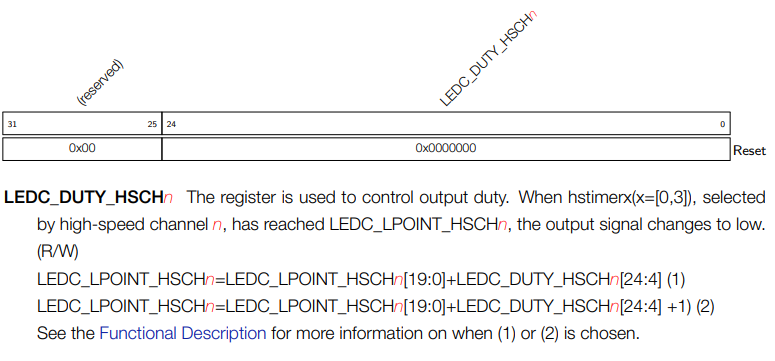

# Pulse Width Modulation (PWM) and Hardware Timers 

In this lecture we are going to look a bit deeper at some of the hardware peripherals within our ESP32 devices. In particular, we will explore the Pulse Width Modulation (PWM) hardware peripherals and the hardware timer modules.


# Digital-to-Analogue conversion
There are two main ways to perform digital-to-analogue conversion:

* Using a resistor-ladder network.
* Using a PWM module

A resistor-ladder based Digital-to-Analogue Converter (DAC) uses a chain of resistors to produce a current that is weighted based on the significance of the bit that is fed into the DAC. In the last lecture, we explored how analogue to digital conversion is performed with the FlashADC circuit, you can think of the resistor-ladder network DAC as the inverse of this.

A PWM-based DAC is different; unlike the previous approach where the output voltage can vary between a range of values, the output of a PWM can only be high or low, i.e. it is a purely digital signal. However, what changes is the amount of time the output spends high or low. Varying the rate at which the circuit is switched on and off has the effect of varying the average voltage experienced at the output pin. Essentially a PWM generates a simulated analogue signal. PWM based approaches are frequently the most common seen in microcontrollers, and are typically used to control LEDs, motors, and other external actuators.  

__Let's look at both of these approaches in a bit more detail:__

## R-2R resistor ladder network


A resistor-ladder based DAC will produce a varying output voltage at discrete intervals between 0V and the supply. Essentially how this works is that 

__TODO: think a nice way to explain this!__

The most siginificant bits (MSBs) will contibute the most current, as the least significant bits will contribute the least (LSBs). They are also carefully weighted by the R-2R ladder network so that each bit will increase the current contribution by a power of 2.  

There are however, problems with this approach. Putting resistors in silicon is seriously expensive in both power and area. Resistors tend to dissapate lots of power as they resist current, and manufacturing them into the silicon requires special techniques, with additional manufacturing steps, that uses up lots of silicon resources. For these reasons, 2R-R ladder based DACs in microcontrollers tend to either be:

* Small -- on the ESP32 we only have two 8-bit DACs
* Non-exsistent, with microcontrollers generally only relying on PWM hardware instead. For instance, the Arduino Uno does not have a DAC, only PWMs.

## Example of using the DAC on the TinyPico


As mentioned above the ESP32 has two DAC channels that we can use that I'll quickly demonstrate.
For this course we wont go too deep into the configuration of the DAC hardware, instead we will use the Arduino ``dacWrite()`` libraries provided for interfacing with it.

However, if you are keen to explore further, then on page 637 of the [[ESP32 TRM](https://www.espressif.com/sites/default/files/documentation/esp32_technical_reference_manual_en.pdf)] details are given for the DAC hardware module. The ESP32 DAC has some interesting features, such as a cosine wave generator, which is a block of hardware that can be configured to generate cosine waves by itself.


From the pinout of the TinyPico we can see that pins 25 and 26 of the PCB have been connected up to the two DAC outputs. Let's try and use the ``dacWrite()`` function to drive this pin.

```C
const unsigned int dacPIN = 25;

void setup() {

}

uint8_t value = 0;

void loop() {
        value = value + 1;
        dacWrite(dacPIN, value); 
}
```

In this program we are using pin 25 as the DAC output channel and we are writing to it with the ``dacWrite()`` arduino function. From reading the [[ESP32 TRM](https://www.espressif.com/sites/default/files/documentation/esp32_technical_reference_manual_en.pdf)] we can see that the DAC accepts an 8-bit number as an input, hence, we are incrementing an 8-bit unsigned (``uint8_t value``) integer which we are using to drive the DAC. However, when we look at the output of 25 on an oscilliscope we get the following:


We can see that the voltage steadily increases as we increment the ``value`` variable, and that it wraps around when the overflow occurs. However, we can also see that on the high values the output saturates (stops increasing and stays level). I suspect the likely reason for this is that I am powering my TinyPico off 3.3v (instead of 5V) which is limiting the maximum voltage that we can output. After some experimenting and changing the ``loop()`` function to the following: 

```C
void loop() {
        value = value + 1;
        if(value >= 200)  
                value = 0;  
        dacWrite(dacPIN, value); 
}
```

We get the following oscilloscope output:


Which avoids the saturation region and looks much nicer.

### Generating a sine wave

To demonstrate this further I would like to use the DAC output to generate a sin wave. We can use the builtin Arduino ``sin`` function to do this.

```C
const unsigned int dacPin = 25;

const float conversionFactor = (2*PI)/200; 

void setup() {

}

uint8_t value=0;

void loop() {
        value = value + 1;
        if(value >= 200) 
                value = 0;

        dacWrite(dacPin, sin(value*conversionFactor)*100 + 100);
}
```

In the code above we are using turning the value signal into an angle (in radians) using the variable ``float conversionFactor``. Since we know we have 200 possible values, we have worked out what each unit of the ``2*PI`` circle we want to give each value. __TODO: better explanation here__. 
The next thing that we need to do is shift the signals up as our DAC will not understand negative values and ``sin`` will produce negative values. ``sin(value * conversionFactor)`` will produce a value between ``0-1`` so we multiply this by ``100`` and then add ``100`` to move it into the middle of the range. 

This produces the following output on the oscilliscope:


The scope output looks okay, however, the frequency is a little low, just 300Hz. Any ideas how we can get it faster?

The culprit for limiting our output frequency is the ``sin(value * conversionFactor)*100 + 100`` bit of code. Trignometric functions, such as `sin`, are quite computationally expensive to calculate. On top of that floating point operations, such as ``value *conversionFactor``, are also quite expensive. One trick that you will see constantly used in embedded systems is to use a look up table.

A lookup table is essentially a precomputed table of values that you can use to lookup an answer to an expensive function. Think back to primary school when you would use multiplication tables to look up the answer to a problem, it's the same principle here. We can precompute the values for our expensive ``sin()`` operation in an array in the setup function, and then just use an array lookup to get the value we need in the ``loop()`` function.

```C
const unsigned int dacPIN = 25;

uint8_t sine_lookup[200];
const float conversionFactor = (2*PI)/200;

void setup() {
        float radAngle;
        for(unsigned int angle=0; angle<200; angle++){
                radAngle = angle*conversionFactor;
                sine_lookup[angle] = (sin(radAngle)*100) + 100;
        }
}

uint8_t idx = 0;

void loop() {
        idx = idx + 1;
        if(idx >= 200)
                idx = 0;
        dacWrite(dacPIN, sine_lookup[idx]);
}
```

The code about produces the following oscilloscope trace on pin 25:


Which is now oscillating at 900Hz.

Sometimes embedded systems are quite constrained in terms of instruction space. For these reasons you will often see such lookup tables precomputed at compile time (rather than in the ``setup()`` function).

```C
const unsigned int dacPIN = 25;

uint8_t sine_lookup[200] = {100,103,106,109,112,115,118,121,124,127,130,133,136,139,142,145,148,150,153,156,158,161,163,166,168,170,172,175,177,179,180,182,184,186,187,189,190,191,192,194,195,196,196,197,198,198,199,199,199,199,200,199,199,199,199,198,198,197,196,196,195,194,192,191,190,189,187,186,184,182,180,179,177,175,172,170,168,166,163,161,158,156,153,150,148,145,142,139,136,133,130,127,124,121,118,115,112,109,106,103,99,96,93,90,87,84,81,78,75,72,69,66,63,60,57,54,51,49,46,43,41,38,36,33,31,29,27,24,22,20,19,17,15,13,12,10,9,8,7,5,4,3,3,2,1,1,0,0,0,0,0,0,0,0,0,1,1,2,3,3,4,5,7,8,9,10,12,13,15,17,19,20,22,24,27,29,31,33,36,38,41,43,46,49,51,54,57,60,63,66,69,72,75,78,81,84,87,90,93,96};

void setup() {

}

uint8_t idx = 0;

void loop() {
        idx = idx + 1;
        if(idx >= 200)
                idx = 0;
        dacWrite(dacPIN, sine_lookup[idx]); 
}
```

What is really cool about this, is that we can now generate arbitrary functions with a bit of C or Python, or Matlab, and generate arbitrary functions with out TinyPico. Without having to change any of our code, just the values that are loaded into the table.

The DAC is a really neat feature that is built into the ESP32, however, this is not common for microcontrollers. As mentioned eariler, including a resistor ladder in the silicon is expensive in terms of the area it uses up. It is also quite low resolution (8-bits), and is quite power hungry when in use. For higher fidelity DACs, for say audio output, generally one would use an external DAC. Typically these are communicated with using a communication protocol such as SPI and have a much higher resolution (but also significant power cost) [[example here](https://www.mouser.co.uk/new/texas-instruments/ti-dac8568-dacs/?gclid=CjwKCAiAyc2BBhAaEiwA44-wW9Pm1TTkPOvvbcvsJGESbIGZRq1hzLzL86xahTTJkDE292uPMku9MxoC8dQQAvD_BwE)].

Generally, when we want to generate an analogue signal from our microcontroller we will simulate an analogue output with something known as a pulse width modulation (PWM).

## Pulse Width Modulation (PWM)

A PWM signal is a digital signal that simulates an analogue one by varying the amount of time that it is spent high and low. If the PWM signal spends a higher porportion of it's time is high, then the average voltage on that output is higher, simulating a higher analogue voltage. If the PWM signal spends most of it's time off, then the average voltage is lower, simulating a lower analogue voltage.

In [[Lecture 3](https://github.com/STFleming/EmSys_GPIO_and_Abstraction_Costs)] we looked at the speed at which we could pulse GPIO pins from software and I briefly mentioned something called the duty-cycle. Let's recap that here:

The duty-cycle refers to the percentage of a periodic square wave where the signal is spent logic HIGH. For instance, the image below has a duty-cycle of 50%.


The signal is high half the time and low half the time. With respect to PWM if we have a 5V logic HIGH, then this signal has an average voltage for the period of the wave of 2.5V, giving us a simulated analogue voltage of 2.5V.


If we increase the duty-cycle then we increase the simulated voltage of our signal. In the waveform above we have a duty-cycle of 75%, giving us a simulated analogue voltage of 3.5V.


Decreasing the duty-cycle will have the opposite effect, decreasing the average voltage as for more of the time the signal is turned off. Thus reducing the simulated voltage. In the above example, the duty-cycle is reduced to 25% resulting in an average voltage of 1.25V. 

### Generating PWM signals

Often it is a requirement that PWM signals are very accurate, for instance, they might be driving motor controllers that need incredible high accuracy. To be able to adjust the simulated voltage with high precision requires, the ability to generate square-waves with high-accuracy at high-frequencies.

As we saw in [[Lecture 3](https://github.com/STFleming/EmSys_GPIO_and_Abstraction_Costs)] it can be difficult to reliably generate precise waveforms from software. This is especially true if we want to generate accurate signals at high frequencies:

* Function call and loop overheads can get in the way
* There can be fluctuations in the output do to scheduling program instructions
* Other tasks can intefere and block the output from changing
* Our maximum frequency is limited to 6MHz (which might be okay for some applications, but not all, and this is all the CPU was allowed to do)

__For this reason virtually _all_ microcontrollers provide specialised hardware peripherals purely for generating PWM signals on output pins.__

* Custom hardware is not constrained by instruction scheduling in software. Software configures the hardware once and then the PWM circuit can generate the signals concurrently in the background.
* Custom hardware cannot be effected by other inteferring tasks. If the currently running task is swapped to service another task the PWM hardware is uneffected.
* Custom hardware can drive the pins at a much higher frequency as it has a much more direct connection to the I/O pins.

On the ESP32 we have bucketloads of PWM modules:

* 16 LED control PWMs (LEDC). Used for a lot more than just controlling LEDs.
* 6 Motor Control PWMs (MCPWM). has extra hardware and signals for: fault detection, such as a motor drawing too much current; capture signals, directly read I/O to influence the motor control without involving the CPU at all. (This is incredibly cool if you need your motor to react to situations with very tight latency constraints.) 

### Structure of a PWM hardware peripheral

The motor control stuff is probably a little out of scope for this course, perhaps if we had physical labs we could do some experiments; for now I'll just focus on the LEDC PWM peripherals.

Looking at the TRM we get the following diagram for the PWM hardware peripherals.


This thing looks quite intimidating but it's actually not too bad, let's break it down piece by piece. 


At the heart of this thing is the Timer circuit. This is used to count how many clock cycles to keep the signal high for, and then how many clock cycles to keep it low. These hardware timers are super accurate, they essentially count individual clock cycles, so their accuracy is one clock period.

The actual clock that is counted is configurable, via the memory-mapped register bit ``LEDC_TICK_SEL_HSTIMERx``, where x is the particular timer that we are using. However, generally on the ESP32 it is the 80MHz ``APB_CLK``, giving our timer a highly precise potential accuracy of ``1/(80000000) = 12.5ns``, the time it takes light to travel 3.74 meters. 

### Clock Divider

Once the clock has been selected in the timer circuit the next stage is a potential clock divider. This is used to lower the frequency of the clock. Clock dividers are generally simple circuits that use something called a D-Type Flip-Flop. 


A D-Type flip flop is a simple hardware primitive that has 4 ports:

* A clock input (clk)
* A D input
* A Q output
* A !Q output (the inverse of the Q output, sometimes a Q with a bar above it)

How a D-Type flip-flop works is that whenever the clock input rises from 0 -> 1 the current value at D is copied over to Q. This means that by using the negated value at Q we can in essence make every period of the clock take twice as long as it should, dividing the clock by two. There are more complicated divider circuits that I'll leave interested readers explore [[here](https://www.falstad.com/circuit/circuitjs.html?ctz=CQAgjCAMB0l3BWcMBMcUHYMGZIA4UA2ATmIxAUgoqoQFMBaMMAKDASWZXGO7ABZ+PblUhsOIXELC9JCPrNosA7pMjSMhNdMUrtIFCiFT9Y1VwNHwYbibPXb6-Xb0WZfG+BR4oe-nC8ffyp3X3NPGx80H0iwg3xA+JjCUT1oxODEsQAlB0shfiirCD5KaBLoJBRKqChKlgBZEEzQ-kIdEQN69mwk8E19MAGqToQWAHtrSU7+Zlo6+EgyQgRCFCQRqewJr2na2bB5mEXl1fXa1iA)].

Why would we want to divide our clock!? Wont this lower the accuracy of our timer?

__yes__ -- but sometimes we have to because of the counter.

### The Hardware Timer Counter

The hardware counter essentially produces a binary number that increments every clock edge.


The problem is that the counter has a fixed number of bits. In the case of the ESP32 PWM modules each counter has 20-bits. This means that at most it can count ``2^20 = 1048576`` clock cycles, which if we are using the 80MHz clock at it's maximum rate (i.e. no divider) then we can only time at most 13.11ms, which might not be long enough for some use cases. Hence we need the divider.  

### The Comparators


The next portion of the PWM hardware peripheral is the comparators used to set the channel output. This portion is responsible for looking at the output of the timer module and comparing the value of the counter against software writable registers that control whether the signal should be latched high or low.


Above shows an example of how the timer value, the comparator thresholds, and the output signal are related. The black line represents the increasing timer value, which wraps around at the overflow point, as the ``lpoint`` and ``hpoint`` dotted lines represent the thresholds used to set the outputs.

Let's walk through what is happening in the diagram above:

1. Initially the timer value is at ``0`` and the output ``sig_out`` is __LOW__.
2. The timer count increases and it reaches the first threshold value ``hpoint``, which triggers ``sig_out`` to become __HIGH__.
3. The timer count continues to increase and it hits the second threshold ``lpoint``, with triggers `sig_out`` to become __LOW__.
4. The timer count continues to increase until it hits it's overflow value, where it is then reset back to ``0``.
5. return to 1

If software wants to change the behaviour of the PWM, such as the duty cycle, then it can do so a few ways. It can write to memory-mapped hardware registers to either:

* Change the overflow period of the timer
* Change the divider value of the timer 
* Change the ``lpoint`` threshold
* Change the ``hpoint`` threshold

## Playing about with the hardware

Let's play with the PWM hardware to see if we can get it to do stuff without using too many Arduino API calls.

I will however use the following Arduino setup code to connect a hardware PWM channel to a GPIO pin. We could do this with low-level register reads and writes, but we would get bogged down in the details, so for simplicity lets leave the setup Ardunio API based.

```C
const unsigned int pwmPin = 15;
const unsigned int freq = 5000;   
const unsigned int pwmChannel = 0;
const unsigned int resolution = 8;

void setup() {
  ledcSetup(pwmChannel, freq, resolution);
  ledcAttachPin(pwmPin, pwmChannel);
}

void loop() {

}
```

This code is doing the following:

* Sets up the PWM Channel 0 ``pwmChannel`` timer so that it has a resolution of 8-bits. This means that the we are telling the timer in the PWM hardware only to use the bottom 8-bits of its counter, remember that the maximum is 20 bits. The counter will count up to 256 and then wrap around.
* Sets the frequency of the timer to be 5KHz ``freq = 5000;``, this sets up the clock-divider so that the counter counts at this frequency.
* Attaches the PWM Channel 0 to GPIO pin 15. This configures the internal routing logic in the I/O to connect the output of the PWM to pin 15.

Now let's connect a logic analyser to GPIO pin 15 and see what we get at the output!


Not a lot. The reason is because we have not set up the thresholds ``lpoint`` and ``hpoint`` that determine at what timer counter value we should set the output high or not. By default the ``lpoint`` and ``hpoint`` are set to 0. If we look at Figure 88 in the TRM (or the cutout above) we can see that this will mean that ``sig_out`` is always low.

What we are going to do now, is change the position of ``lpoint``. If we increase it a bit then the signal will be on a little bit longer. Remember that we have configured out timer to be 8-bits, this means that it is counting up to 256, so if we set the ``lpoint`` to 128 then we will have a 50% duty-cycle as we will be switching halfway through the timer's counting.

To set the registers for the ``lpoint`` threshold we could use the Arduino function ``ledcWrite(pwmChannel, value);`` where value is the position in the 8-bit number that we want to set the threshold at. However, let's try and use the underlying hardware registers instead.


The main register for setting the ``lpoint`` of Channel 0 is ``LEDC_HSHC0_DUTY_REG`` which has the memory-mapped address: ``0x3FF59008``

Looking at the description for this register we get the following:



We can see that to set the ``lpoint`` (``LEDC_LPOINT_HSCH0``) we need to write to the ``LEDC_DUTY_HSCH0`` portion of this register, specifically bits ``24 - 4``. The bottom 4 bits are for fine adjustment of the PWM signal, which we wont worry about here. So, to change the LPOINT we can add a write to this register in our code above within the body of ``loop()``.

```C
const unsigned int pwmPin = 15;
const unsigned int freq = 5000;   
const unsigned int pwmChannel = 0;
const unsigned int resolution = 8;

void setup() {
  ledcSetup(pwmChannel, freq, resolution);
  ledcAttachPin(pwmPin, pwmChannel);
}

unsigned int * LEDC_HSCH0_DUTY_REG = (unsigned int *)(0x3FF59008);

void loop() {
        for(int i=0; i<256; i++) {
                *LEDC_HSCH0_DUTY_REG = (i << 4); 

                delayMicroseconds(100);
        }
}
```

This code will every microsecond increase the value of the ``lpoint`` with the line ``*LEDC_HSCH0_DUTY_REG = (i << 4);``. Notice the shift to the left 4 places as we are using bits ``24 - 4``. 

However, there are a few more registers that we need to set before we can get this to work. 

* We need to set a bit to enable the output
* We need to set a start bit to load in the change we made to the ``LEDC_HSHC0_DUTY_REG`` above

To do this we need to configure two control registers of the PWM hardware: ``LEDC_HSCH0_CONF0_REG`` and ``LEDC_HSHC0_CONF1_REG``. 


To enable the output we must set bit 2 of ``LEDC_HSCH0_CONF0_REG``, we can do this once outside the loop. 

```C
const unsigned int pwmPin = 15;
const unsigned int freq = 5000;   
const unsigned int pwmChannel = 0;
const unsigned int resolution = 8;

void setup() {
  ledcSetup(pwmChannel, freq, resolution);
  ledcAttachPin(pwmPin, pwmChannel);
}

unsigned int * LEDC_HSCH0_DUTY_REG = (unsigned int *)(0x3FF59008);
unsigned int * LEDC_HSCH0_CONF0_REG = (unsigned int *)(0x3FF59000);

void loop() {
        *LEDC_HSCH0_CONF0_REG = (1 << 2);
        for(int i=0; i<256; i++) {
                *LEDC_HSCH0_DUTY_REG = (i << 4); 

                delayMicroseconds(100);
        }
}
```

Notice the ``(1 << 2)`` to shift the binary value ``...00001`` by two places to the left to get ``...00100`` to set just bit 2.


Finally, every time we change the configuration of the PWM we need to set an update bit that applies the changes we have made, in this case this is bit 31 of of register ``LEDC_HSCH0_CONF1_REG``

```C
const unsigned int pwmPin = 15;
const unsigned int freq = 5000;   
const unsigned int pwmChannel = 0;
const unsigned int resolution = 8;

void setup() {
  ledcSetup(pwmChannel, freq, resolution);
  ledcAttachPin(pwmPin, pwmChannel);
}

unsigned int * LEDC_HSCH0_DUTY_REG = (unsigned int *)(0x3FF59008);
unsigned int * LEDC_HSCH0_CONF0_REG = (unsigned int *)(0x3FF59000);
unsigned int * LEDC_HSCH0_CONF1_REG = (unsigned int *)(0x3FF5900C);

void loop() {
        *LEDC_HSCH0_CONF0_REG = (1 << 2);
        for(int i=0; i<256; i++) {
                *LEDC_HSCH0_DUTY_REG = (i << 4); 
                *LEDC_HSCH0_CONF1_REG = (1 << 31); 
                delayMicroseconds(100);
        }
}
```

Using our logic analyser we can see the following output at pin 15.


Which is what we expect, we can see the length of time the signal is spent high increasing as we increase the ``lpoint`` threshold by periodically writing to the appropriate hardware registers.

Then finally to demonstrate that this is really simulating an analogue voltage, we can hook up an LED to pin 15 and watch it fade!


